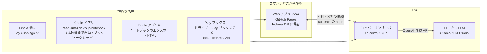

# 本 — bookshelf

Play ブックスと Kindle で線を引いた箇所（ハイライト）を **このシステムに 1 か所にまとめて** 管理し、PC の **ローカル LLM** がそれらの「点」を **線 → 面 → 立体** に組み立てて、次に読む本を提案するシステムです。

- **Web アプリ（モバイルファースト・PWA）** … GitHub Pages に置ける静的サイト。ハイライトの閲覧・検索・**文の修正**（点の ✎ で、線を引いた文そのものを直せる。取り込んだときの文も残り、再取り込みで上書きされない。直した点のカードには「直した文」と出て、✎ の「この文に戻す」で取り込んだときの文へ戻せる。検索の画面の「直した文」で、文を直した点だけに絞れる）・**点の削除**（点のカードの × で、編集を開かずに 1 回で消せる。消した直後に出る「元に戻す」で戻せる）・お気に入り（★。線(グループ)にも付けられ、ホームの「★」から★の点と線(グループ)をまとめて見返せる）・メモ・タグ付け、**思いつきメモ**（どの画面からも上のバーの「メモ」で、本に関係しない思いつきを書き留める。ホームの受け箱で整理済みにする・捨てる。捨てていないものは分析の点になる。PC とまだ同期していないメモのカードには「PC に未同期」と出て、同期すると消える。受け箱の「線(グループ)に入れる」で、分析を待たずに既存の線(グループ)へ自分で入れられる〔分析し直しても外れない・外せる・同期される〕）、AI 分析の結果表示、**読書記録**（読み終えた本の冊数・ページ数を年・月・日ごとに集計。線を 1 本でも引いた本は、最初に線を引いた日に読み終えたとして自動で数える〔線に日付が無い Kindle の本はノートブックの最終ハイライト日。どちらも無い本は「読み終えた日が分からない本」に並べる〕。手で付けた記録・ページ数・記録から外した本はこのリポジトリの `records` ブランチの `records.json` に GitHub のトークンで保存し、どの端末からでも見られる。トークンの作り方は読書記録の画面に表示。ホームの統計の下にも今月の冊数・ページ数を 1 行出す〔記録を読めないときは出さない〕）
- **PC のコマンド `bh`** … 取り込み・AI 分析、そしてスマホと PC をつなぐ **コンパニオンサーバ**
- 依存ライブラリは知識マップの図を描く Cytoscape.js だけ（`web/vendor/` に同梱。npm で入れるものは無く、Node.js 20 以上だけで動く）。ハイライトは自分の端末と PC の中だけに保存されます

考え方の源流（ツェッテルカステン・梅棹忠夫『知的生産の技術』・外山滋比古『乱読のセレンディピティ』）と、それを実現するのにいま足りないものは [docs/concept.md](docs/concept.md) にまとめています。

## 解決したい課題

| これまで | これから |
| --- | --- |
| アプリを開く → 本を開く → ハイライトを見る | この Web アプリで、全ての本の線を引いた箇所をすぐ見られる |
| ハイライトは本ごとにバラバラの「点」 | ローカル LLM が点をつないで「線（概念）」にし、線を束ねて「面（テーマ）」にし、面の関係から「立体（知識の全体像）」を作る |
| 次に何を読むかは勘 | 立体と「まだ答えの無い問い」から、AI が次の本を選ぶ（実在を書誌データベースで確認） |

## 全体の構成



### 「GitHub の静的サイトで AI 機能を使うには？」への答え

GitHub Pages は静的ファイルしか置けず、スマホではローカル LLM を動かせません。そこで **AI の処理は PC のコンパニオンサーバが引き受け**、Web アプリはそこに頼むだけにしています。

1. **PC**：`bh serve` がローカル LLM（Ollama など）への中継・分析ジョブを担当します。`http://localhost:8787` を開けば、同じ Web アプリがそのまま使えます（Safari を含むすべてのブラウザで動作）。
2. **スマホ**：`tailscale serve --bg 8787` で PC を自分専用の https URL（`https://<PC名>.<tailnet>.ts.net`）として公開し、スマホの Web アプリ（GitHub Pages 版でもよい）の設定に入れます。分析は PC で走るので、**スマホの画面を閉じても続きます**。
3. **結果はスマホにも残る**：分析結果は PC との同期でスマホの Web アプリにも保存されるので、PC が止まっていても読み返せます。

直接つなぐ方式（ブラウザ → `http://localhost:11434`）も選べますが、Safari は https のページから localhost に接続できず、Chrome / Firefox でも「ローカルネットワークへのアクセス」の許可と `OLLAMA_ORIGINS` の設定が要るため、コンパニオンサーバ経由をおすすめしています。詳しくは [docs/architecture.md](docs/architecture.md)。

## はじめかた

### 1. まず試す（インストール不要）

GitHub Pages で公開した Web アプリ（このリポジトリなら `https://nihi566.github.io/bookshelf/`。公開手順は [docs/setup.md](docs/setup.md)）を開き、「サンプルで試す」を押します。架空の 8 冊・48 の点で画面を確認できます。ホーム画面に追加すればアプリのように使えます。

### 2. PC を準備する（AI）

```sh
git clone https://github.com/nihi566/bookshelf.git
cd bookshelf

# ローカル LLM（例: Ollama）
ollama pull qwen3.5:9b     # 日本語が得意なチャットモデル（PC の性能に合わせて 4b〜27b）
ollama pull bge-m3         # 多言語の埋め込みモデル（任意。無ければ文字の特徴で代用）

node cli/bh.js config model qwen3.5:9b
node cli/bh.js config embed bge-m3
node cli/bh.js serve                               # → http://localhost:8787
```

main を更新したあと、常駐の `bh serve` を新しいコードに入れ替えるには `node cli/bh.js update`（データを退避 → main を取り込む → 起動し直す → 新しい版か確かめる。[docs/setup.md](docs/setup.md)）。`npm link` すれば `bh` だけで呼べます。LM Studio や llama.cpp server も `bh config url http://localhost:1234` のように OpenAI 互換 API の URL を指定すれば使えます。

### 3. スマホからつなぐ

```sh
tailscale serve --bg 8787   # https://<PC名>.<tailnet>.ts.net で PC に届くようになる
```

スマホに Tailscale アプリを入れて同じアカウントでログインし、Web アプリの「設定 → AI」にその URL を入れて「接続を確認」。詳しい手順は [docs/setup.md](docs/setup.md)。

## ハイライトの取り込み

| 読み方 | 方法 |
| --- | --- |
| Kindle アプリ（自動） | PC の Chrome / Edge に **拡張機能**（`extension/`）を入れると、ノートブックを 15 分ごとに確認して新しい線だけを `bh serve` に送る。ノートブックのタブは開いておかなくてよい（Chrome が起動していて Amazon にログインしたままなら動く。ログインが切れると拡張機能と Web アプリに表示されるので、そのときだけログインし直す）。手順は [docs/setup.md](docs/setup.md) の 5.5 |
| Kindle アプリ（手動） | PC のブラウザで **ブックマークレット**（取り込み画面からドラッグして登録）を read.amazon.co.jp/notebook で実行 → 全冊まとめて「アプリに送る」か JSON で保存 |
| Kindle 端末 | USB でつなぎ `documents/My Clippings.txt` を取り込む |
| Kindle アプリ（1 冊ずつ） | ノートブック → エクスポート でメールした HTML を取り込む |
| Play ブックス | 設定で「メモ、ハイライト、しおりを Google ドライブに保存」をオン → **自動**: PC で `bh google login` して `bh serve` を動かしておくと、線を引くたびに取り込む（[docs/setup.md](docs/setup.md) の 3.5）／**手動**: ドライブの「Play ブックスのメモ」フォルダをダウンロード（zip）してそのまま取り込む。スマホでは各ドキュメントを .docx で保存 |
| 紙の本 | 「読んだ本」の「＋ 紙の本」で書名・著者・表紙の画像を登録し、本の画面で線を引いた文（ページ・章は任意）を入力する。表紙は端末で縮小してから保存し、PC・ほかの端末と同期する |
| 読書メモ（Obsidian など） | 自分で書いた読書メモの `.md` を取り込み画面で選ぶか、PC で `bh import <フォルダ>`（入れ子のフォルダも読む。`--dry-run` で保存せずに確認）。ファイル名を書名、見出しを章、段落・箇条書きの項目を 1 点にする。書名の一部が同じ本が 1 冊だけあればその本にまとめ、既にある線と同じ文は増やさない。画像の埋め込みは取り込めない |

何度取り込んでも重複しません。Kindle で伸ばしたハイライトは新しい方に置き換わり、付けたお気に入り・メモ・タグ・直した文は引き継がれます。文を直した点は、同じ文をもう一度取り込んでも直した文のままです。削除した点は再取り込みしても戻りません（押し間違えたときは、削除した直後の通知の「元に戻す」でメモ・タグ・★ごと戻せます）。Play ブックスでは、長いハイライトの一部を別の箇所でもう一度引いた短いハイライトも、それぞれ残ります。

**技術書（IT の教科書）の線は「点」に数えません。** 本の一覧・本の画面で見たり検索したりはできますが、点の数・今日の点・AI 分析（点 → 線 → 面 → 立体）からは外します。技術書かどうかは書名（SQL・PHP・Linux・プログラミングなど）から自動で判断し、本の画面の「本の情報を編集」で本ごとに決め直せます。

PC では `bh import <ファイル...>` でも取り込めます。

### スマホと PC の同期

スマホで付けた★・メモ・タグ・削除と、PC で取り込んだ章・色・位置などは、**欄ごとに統合**します。自分の編集はいつ付けたかで比べるので、同期する前に PC で別の形式を取り込んで同じハイライトの欄が埋まっても、スマホの編集は消えません。

## AI 分析のしくみ（点 → 線 → 面 → 立体）

1. **点**：ハイライトと思いつきメモを埋め込みベクトルにする（`bge-m3` など。無ければ文字 n-gram の TF-IDF）。点に付けた自分のメモ・タグも一緒に埋め込む
2. **線**：意味の近い点（およそ 8 件ずつ）を球面 k-means で束ね、LLM が共通する考えを一段抽象化して「概念」にする。本をまたいだつながりが見つかる。LLM には自分のメモ・タグを「読者自身の言葉」として渡し、★の点を優先して見せる
3. **面**：線を束ね、LLM がテーマにまとめる
4. **立体**：LLM が面どうしの関係（支える・対立する・具体化する・補完する）、知識の核、行動の原則、まだ答えの無い問いを組み立てる
   - **遠いつながり**：似たものを束ねるだけでは「想定内の答え」にしかならないので、分析のたびに、別の本・別の面にあって意味の近さが低めの点の組（線の中心の点と、まだつながっていない点。まだつながっていない点を含む組を先に）を最大 10 組選び、LLM が「根っこで共通する考えがあるか」を判定します。あると判定した組は、共通する考え・なぜつながるか・両側の点とともに知識の画面の「遠いつながり」に出ます。「面白い」とした組は分析し直しても残り、「ちがう」とした組はもう出しません（押し間違えたら「すべての遠いつながり」で取り消せます。反応は PC と同期）。判定した組は二度判定せず、分析のたびにまだ試していない組を試します。新しい遠いつながりは「発見」にも入ります
5. **おすすめ**：LLM が立体と「問い」から本を探す検索語を決め、**Google Books で見つけた実在の本の中から**「深める・広げる・揺さぶる」本を選んで理由を書く（既読の本は除く）。検索できないときは LLM が挙げた書名を Google Books → 国立国会図書館サーチで照合し、見つからない本には印を付ける
   - **好みに閉じない**：候補があるかぎり、毎回「広げる」と「揺さぶる」を 1 冊以上ずつ入れます。LLM が選ばなかったときは、その種類で探し直して足します（「興味なし」を付けた本があっても「揺さぶる」の枠は残します）
   - **欲しい本との連携**：価格チェック（`kindle_system/` が集める欲しい本）の欲しい本のうち、知識の全体像に書名が近い本（最大 8 冊）も候補に混ぜ、選ばれたら価格・Kindle Unlimited をカードに出す。購入済み（タグも含む）・「読んだ」の本は書誌データベースで見つかっても出さない。タグはブラウザにしか無いので、Web アプリが分析・選び直しのたびに PC へ送る（PC には保存しない）。`bh analyze` / `bh recommend` は欲しい本を使わない
6. **おすすめへの反応**：おすすめの本に「読んだ／読みたい／興味なし」を付けると、次からその本は挙がらず、「読みたい」「興味なし」の傾向が次の選定に使われます。反応は PC と同期されます

小さなローカルモデルでも崩れにくいよう、1 回の依頼を小さくして JSON スキーマで出力を固定しています（ローカル LLM は本の知識があいまいで、書名だけを挙げさせると実在しない本を作りがちなので、おすすめは書誌データベースの候補から選ばせています）。

### 往復を自動で繰り返す

- **増分の分析**: 再分析では前回の線・面を引き継ぎ（線の ID は変わらない）、増えた点は近い線に加え、変わった線・面・立体だけ AI を呼びます。点を 1 件足しただけなら、線・面・立体のために AI を呼ぶのは多くて 5 回です（埋め込みモデルの有無によらない。おすすめの本を選び直すときの数回と、遠い組み合わせの判定の最大 10 回は別）。知識の画面の「最初から作り直す」（`bh analyze --full`）で、すべて作り直すこともできます。前回作り直したときから点が 1.5 倍（かつ 40 件以上）に増えた回は、線・面の形を整えるため自動で作り直します（AI を線の数だけ呼び、線の ID も変わります）
- **自動の分析**: `bh serve` が動いていれば、前回の分析のあとに点（思いつきを含む）が 10 件増える・減るか、24 時間たって点が 1 件以上増えた・減ったか永久ノートを書いた・直したとき、PC が人の操作なしに分析し直します（本を技術書にした・消したなどで消えた点は線から外れます。手動の分析中・取り込みの最中は待つ。永久ノートだけを直した日は、前回から 24 時間たつのを待ってから、そのノートで面・立体を作り直します）。失敗しても前回の結果は残り、理由と最後に成功した時刻が知識の画面に出て、30 分あけて試し直します。失敗が続いているあいだは、ホームの先頭にも「PC の分析が N 回続けて失敗しています（理由）」と出ます（押すと知識の画面へ。成功すると消えます）。中止したときも 30 分あけます。自動の分析ではおすすめの本は前回のものを残します（欲しい本の「購入済み」などの印は画面の側にあるため。「おすすめを選び直す」で選び直せます）。`bh config auto off` で止める、`bh config auto-points 20` / `bh config auto-hours 12` で条件を変えられます。`bh serve` の自動の分析と `bh analyze` を同時に動かすと、あとに書いた方の結果が残ります
- **履歴**: PC に直近 12 回分の分析が残り、知識の画面で「前回から増えた線・大きくなった線・消えた線・新しくつながった点」と、過去の分析を見られます。自動の分析で前より分かりにくくなったら、過去の分析の画面の「この分析に戻す」で、その回の線・面・立体に戻せます（次の分析は戻した回から引き継ぎます。PC が分析している間は戻せません）。残しておきたい回は、過去の分析の画面の「この回を残す」で印を付けると、直近 12 回を過ぎても消えません（印は 12 回まで。履歴の一覧に「残す」と出ます。「残すのをやめる」で外せます）
- **増えた点の案内**: 知識の画面の「前回の分析」の下と、ホームの立体の欄に「前回の分析のあとに増えた点 N 件（まだ線につながっていません）」が出ます（前回のどの線にも「まだつながらない点」にも入っていない点を ID で数える。ホームでは 1 件以上のときだけ出て、知識の画面の「分析し直す」へリンクします）。「N 件」を押すと、数えた点そのものが点のカードで並ぶので、分析し直す前にメモ・タグ・★を付けておけます
- **発見を届ける**: 分析のたびに、前回からの差で見つかったつながり（増えた点が別の本の点とつながった・新しい線ができた・まだつながっていなかった点がつながった・新しい遠いつながり）を「発見」として、ホームの上の方に未読の新しい順に 3 件と件数を出します。開くと、どの点とどの点がなぜつながったかが見え、既読になります（既読は端末の間で同期）。「今日の点」には、その点とつながる別の本の点を 1 件添えます

### 永久ノート（自分の言葉で残す）

- **1 ノート = 1 アイデア**: 題・本文・根拠の点（0 件以上）を持つノートを、知識の画面の「永久ノート」（`#/notes`）で書く・直す・消す・探すことができます。PC と同期し、バックアップにも入ります
- **AI の線を下書きにする**: 線の画面の「この線を永久ノートにする」を押すと、線の名前・説明・問いと線の点を写したノートができます。あとは自分の言葉に直します
- **受け箱のメモから作る**: 受け箱のメモの「永久ノートにする」で、そのメモを根拠にしたノートになります（メモは整理済みになり、分析の点のまま残ります）
- **点から作る・根拠に足す**: 点のカードの「↗」で点のページを開き、「この点を根拠に永久ノートを書く」「ほかの永久ノートの根拠にする」が使えます。点・線・面の画面には、それを根拠にしているノートが出ます
- **分析し直しても残る**: AI はノートを書き換えません。根拠の点が消えたら、ノートに「根拠の点が消えた」と出ます（Kindle で伸ばしたハイライトは、伸ばしたあとの点をたどります）。ノートは面・立体を作る AI に「人間がまとめた線」として渡り、書き直すとその面と立体だけを作り直します

### リンク（つながりを自分で張る）

- **どれどうしでも結ぶ**: 点・メモ（思いつき）・永久ノートのどれどうしでも、その画面の「リンクを張る」で相手を言葉で探してリンクできます。理由を 1 行添えられます（書かなくてもよい）。リンクは両側の画面に出て、相手を押すとその画面へ行き、そこからさらにたどれます。「理由」で直し、「外す」で外せます（理由も消えます）。点どうし・点とメモのリンクは「ノートにする」で、両端の点を根拠に、理由を題の下書きにした永久ノートを書き始められます。PC と同期し、バックアップにも入ります
- **意味の近い点**: 分析すると、点の画面に「意味の近い点（別の本から）」が最大 5 件出ます。「リンクする」を 1 回押すとリンクになります
- **関わる線・関わる点**: 点は 1 本の線に入りますが、ほかの線にも、その線の点と同じくらい近い点は、その線の画面に「関わる点（ほかの線から）」、点の画面に「関わる線」として出ます
- **遠いつながりも網に入る**: 遠いつながりで「面白い」とした組は、両方の点の画面にリンクとして出ます（共通する考えが理由）
- **消えた相手**: リンクした点やノートを消すと「（消えた点）」「（消えたノート）」と出ます（リンクは外せます）。Kindle で伸ばしたハイライトは、伸ばしたあとの点をたどります

### 意味で探す・問いかける（知識と対話する）

PC（`bh serve`）の埋め込みモデル（`bge-m3`）とローカル LLM を使います。スマホからも PC を通して使えます。質問と点の本文は PC のローカル LLM にだけ渡ります。

- **意味で探す**: 検索の画面で「意味で探す」に切り替えると、言葉が一致しなくても、意味の近い点・メモ・永久ノートを近い順に出します（最大 30 件）。PC とつながっていない・PC に埋め込みモデルが無いときは、その理由を出して言葉の一致の検索に戻ります
- **問いかける**: 検索の画面・知識の画面の「問いかける」で質問すると、PC が質問に近い点を最大 8 件集め、ローカル LLM がその点だけを根拠に日本語で答えます。答えには根拠の点（番号・書名と位置）が付き、押すとその点へ行けます
- **答えられないときは答えない**: いちばん近い点でも近さが足りない（本に書かれていないことを聞いた）ときは、AI を呼ばずに「手元の点からは答えられない」と返します。AI が点から答えられないと判断したときも同じです
- **答えをメモにする**: 「メモとして保存」で、答え（と根拠の書名・位置）が受け箱のメモになり、次の分析で点になります

### 文章の骨組み（人にわかる形で書き出す）

- **作る**: 面・線・永久ノートの画面の「文章の骨組みを作る」か、知識の画面の「文章の骨組み」から材料を選ぶと（8 つまで）、PC のローカル LLM が、見出し・各節の要点・使う引用を作ります（`#/outline/new`）。本文の全文は書きません
- **引用は一字一句そのまま**: 引用は点（本に引いた線とメモ）を指すだけで、AI に文を書かせません。画面と Markdown には、点の文をそのまま、書名と位置を付けて出します
- **直して持ち出す**: 骨組みの画面（`#/outline/<id>`）の「直す」で題・見出し・要点（1 行に 1 つ）を直し、引用を外し、節を消す・足すことができます。「Markdown をコピー」で、文章の下書きに貼れます。PC と同期し、バックアップにも入ります

## 開発

```sh
npm test            # node:test（パーサ・モデル・分析・サーバ・CLI）
node cli/bh.js serve  # http://localhost:8787 で Web アプリを開発
```

- `web/` … 静的サイト（GitHub Pages にそのまま公開）。`web/core/` はブラウザと Node で共用する純粋なモジュール
- `cli/` … `bh` コマンドとコンパニオンサーバ
- `kindle_system/` … 欲しい本の価格チェック（Python。Amazon・読書メーターの「読みたい本」を集めて価格を記録する）。
  使い方は `kindle_system/README.md`。テストは `cd kindle_system && python -m unittest discover -s test`。
  集めた本は Web アプリの「価格」（`#/wishlist`）で見られ、書名・出版社・ASIN の検索、出版社（Amazon の商品ページの「出版社」。まだ読めていない本は書名の末尾の「(光文社新書)」のようなレーベル。出版社は価格を取るときに同じページから読むので、次の定期取得から少しずつ埋まる）・タグ・価格・Kindle Unlimited・種別で絞り込める
- `web/wishlist-site/` … `kindle_system/` が書き出す欲しい本のデータ（`wishlist.json` / `feed.xml` / `feed-wanted.xml`。生成物なので直接編集しない）。
  `python run.py sync` がこれらだけを main に commit・push し、Pages に公開される
- `.github/workflows/pages.yml` … テストと GitHub Pages への公開（リポジトリの Settings → Pages で Source を「GitHub Actions」に）

ハイライトのデータ（`data/`）はリポジトリに含めません。
