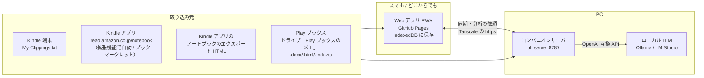

# 本 — bookshelf

Play ブックスと Kindle で線を引いた箇所（ハイライト）を **このシステムに 1 か所にまとめて** 管理し、PC の **ローカル LLM** がそれらの「点」を **線 → 面 → 立体** に組み立てて、次に読む本を提案するシステムです。

- **Web アプリ（モバイルファースト・PWA）** … GitHub Pages に置ける静的サイト。ハイライトの閲覧・検索・お気に入り・メモ・タグ付け、AI 分析の結果表示、**読書記録**（読み終えた本の冊数・ページ数を年・月・日ごとに集計。記録はこのリポジトリの `records` ブランチの `records.json` に GitHub のトークンで保存し、どの端末からでも見られる。トークンの作り方は読書記録の画面に表示）
- **PC のコマンド `bh`** … 取り込み・AI 分析、そしてスマホと PC をつなぐ **コンパニオンサーバ**
- 依存ライブラリなし（Node.js 20 以上だけ）。ハイライトは自分の端末と PC の中だけに保存されます

## 解決したい課題

| これまで | これから |
| --- | --- |
| アプリを開く → 本を開く → ハイライトを見る | この Web アプリで、全ての本の線を引いた箇所をすぐ見られる |
| ハイライトは本ごとにバラバラの「点」 | ローカル LLM が点をつないで「線（概念）」にし、線を束ねて「面（テーマ）」にし、面の関係から「立体（知識の全体像）」を作る |
| 次に何を読むかは勘 | 立体と「まだ答えの無い問い」から、AI が次の本を選ぶ（実在を書誌データベースで確認） |

## 全体の構成



### 「GitHub の静的サイトで AI 機能を使うには？」への答え

GitHub Pages は静的ファイルしか置けず、スマホではローカル LLM を動かせません。そこで **AI の処理は PC のコンパニオンサーバが引き受け**、Web アプリはそこに頼むだけにしています。

1. **PC**：`bh serve` がローカル LLM（Ollama など）への中継・分析ジョブを担当します。`http://localhost:8787` を開けば、同じ Web アプリがそのまま使えます（Safari を含むすべてのブラウザで動作）。
2. **スマホ**：`tailscale serve --bg 8787` で PC を自分専用の https URL（`https://<PC名>.<tailnet>.ts.net`）として公開し、スマホの Web アプリ（GitHub Pages 版でもよい）の設定に入れます。分析は PC で走るので、**スマホの画面を閉じても続きます**。
3. **結果はスマホにも残る**：分析結果は PC との同期でスマホの Web アプリにも保存されるので、PC が止まっていても読み返せます。

直接つなぐ方式（ブラウザ → `http://localhost:11434`）も選べますが、Safari は https のページから localhost に接続できず、Chrome / Firefox でも「ローカルネットワークへのアクセス」の許可と `OLLAMA_ORIGINS` の設定が要るため、コンパニオンサーバ経由をおすすめしています。詳しくは [docs/architecture.md](docs/architecture.md)。

## はじめかた

### 1. まず試す（インストール不要）

GitHub Pages で公開した Web アプリ（このリポジトリなら `https://nihi566.github.io/bookshelf/`。公開手順は [docs/setup.md](docs/setup.md)）を開き、「サンプルで試す」を押します。架空の 8 冊・48 の点で画面を確認できます。ホーム画面に追加すればアプリのように使えます。

### 2. PC を準備する（AI）

```sh
git clone https://github.com/nihi566/bookshelf.git
cd bookshelf

# ローカル LLM（例: Ollama）
ollama pull qwen3.5:9b     # 日本語が得意なチャットモデル（PC の性能に合わせて 4b〜27b）
ollama pull bge-m3         # 多言語の埋め込みモデル（任意。無ければ文字の特徴で代用）

node cli/bh.js config model qwen3.5:9b
node cli/bh.js config embed bge-m3
node cli/bh.js serve                               # → http://localhost:8787
```

`npm link` すれば `bh` だけで呼べます。LM Studio や llama.cpp server も `bh config url http://localhost:1234` のように OpenAI 互換 API の URL を指定すれば使えます。

### 3. スマホからつなぐ

```sh
tailscale serve --bg 8787   # https://<PC名>.<tailnet>.ts.net で PC に届くようになる
```

スマホに Tailscale アプリを入れて同じアカウントでログインし、Web アプリの「設定 → AI」にその URL を入れて「接続を確認」。詳しい手順は [docs/setup.md](docs/setup.md)。

## ハイライトの取り込み

| 読み方 | 方法 |
| --- | --- |
| Kindle アプリ（自動） | PC の Chrome / Edge に **拡張機能**（`extension/`）を入れると、ノートブックを 15 分ごとに確認して新しい線だけを `bh serve` に送る。ノートブックのタブは開いておかなくてよい（Chrome が起動していて Amazon にログインしたままなら動く。ログインが切れると拡張機能と Web アプリに表示されるので、そのときだけログインし直す）。手順は [docs/setup.md](docs/setup.md) の 5.5 |
| Kindle アプリ（手動） | PC のブラウザで **ブックマークレット**（取り込み画面からドラッグして登録）を read.amazon.co.jp/notebook で実行 → 全冊まとめて「アプリに送る」か JSON で保存 |
| Kindle 端末 | USB でつなぎ `documents/My Clippings.txt` を取り込む |
| Kindle アプリ（1 冊ずつ） | ノートブック → エクスポート でメールした HTML を取り込む |
| Play ブックス | 設定で「メモ、ハイライト、しおりを Google ドライブに保存」をオン → **自動**: PC で `bh google login` して `bh serve` を動かしておくと、線を引くたびに取り込む（[docs/setup.md](docs/setup.md) の 3.5）／**手動**: ドライブの「Play ブックスのメモ」フォルダをダウンロード（zip）してそのまま取り込む。スマホでは各ドキュメントを .docx で保存 |
| 紙の本 | 「読んだ本」の「＋ 紙の本」で書名・著者・表紙の画像を登録し、本の画面で線を引いた文（ページ・章は任意）を入力する。表紙は端末で縮小してから保存し、PC・ほかの端末と同期する |
| 読書メモ（Obsidian など） | 自分で書いた読書メモの `.md` を取り込み画面で選ぶか、PC で `bh import <フォルダ>`（入れ子のフォルダも読む。`--dry-run` で保存せずに確認）。ファイル名を書名、見出しを章、段落・箇条書きの項目を 1 点にする。書名の一部が同じ本が 1 冊だけあればその本にまとめ、既にある線と同じ文は増やさない。画像の埋め込みは取り込めない |

何度取り込んでも重複しません。Kindle で伸ばしたハイライトは新しい方に置き換わり、付けたお気に入り・メモ・タグは引き継がれます。削除した点は再取り込みしても戻りません。Play ブックスでは、長いハイライトの一部を別の箇所でもう一度引いた短いハイライトも、それぞれ残ります。

**技術書（IT の教科書）の線は「点」に数えません。** 本の一覧・本の画面で見たり検索したりはできますが、点の数・今日の点・AI 分析（点 → 線 → 面 → 立体）からは外します。技術書かどうかは書名（SQL・PHP・Linux・プログラミングなど）から自動で判断し、本の画面の「本の情報を編集」で本ごとに決め直せます。

PC では `bh import <ファイル...>` でも取り込めます。

### スマホと PC の同期

スマホで付けた★・メモ・タグ・削除と、PC で取り込んだ章・色・位置などは、**欄ごとに統合**します。自分の編集はいつ付けたかで比べるので、同期する前に PC で別の形式を取り込んで同じハイライトの欄が埋まっても、スマホの編集は消えません。

## AI 分析のしくみ（点 → 線 → 面 → 立体）

1. **点**：ハイライトを埋め込みベクトルにする（`bge-m3` など。無ければ文字 n-gram の TF-IDF）
2. **線**：意味の近い点を球面 k-means で束ね、LLM が共通する考えを一段抽象化して「概念」にする。本をまたいだつながりが見つかる
3. **面**：線を束ね、LLM がテーマにまとめる
4. **立体**：LLM が面どうしの関係（支える・対立する・具体化する・補完する）、知識の核、行動の原則、まだ答えの無い問いを組み立てる
5. **おすすめ**：LLM が立体と「問い」から本を探す検索語を決め、**Google Books で見つけた実在の本の中から**「深める・広げる・揺さぶる」本を選んで理由を書く（既読の本は除く）。検索できないときは LLM が挙げた書名を Google Books → 国立国会図書館サーチで照合し、見つからない本には印を付ける
   - **欲しい本との連携**：価格チェック（`kindle_system/` が集める欲しい本）の欲しい本のうち、知識の全体像に書名が近い本（最大 8 冊）も候補に混ぜ、選ばれたら価格・Kindle Unlimited をカードに出す。購入済み（タグも含む）・「読んだ」の本は書誌データベースで見つかっても出さない。タグはブラウザにしか無いので、Web アプリが分析・選び直しのたびに PC へ送る（PC には保存しない）。`bh analyze` / `bh recommend` は欲しい本を使わない
6. **おすすめへの反応**：おすすめの本に「読んだ／読みたい／興味なし」を付けると、次からその本は挙がらず、「読みたい」「興味なし」の傾向が次の選定に使われます。反応は PC と同期されます

小さなローカルモデルでも崩れにくいよう、1 回の依頼を小さくして JSON スキーマで出力を固定しています（ローカル LLM は本の知識があいまいで、書名だけを挙げさせると実在しない本を作りがちなので、おすすめは書誌データベースの候補から選ばせています）。結果はメンバー構成ごとにキャッシュするので、点が増えたときの再分析は変わった部分だけで済みます。

## 開発

```sh
npm test            # node:test（パーサ・モデル・分析・サーバ・CLI）
node cli/bh.js serve  # http://localhost:8787 で Web アプリを開発
```

- `web/` … 静的サイト（GitHub Pages にそのまま公開）。`web/core/` はブラウザと Node で共用する純粋なモジュール
- `cli/` … `bh` コマンドとコンパニオンサーバ
- `kindle_system/` … 欲しい本の価格チェック（Python。Amazon・読書メーターの「読みたい本」を集めて価格を記録する）。
  使い方は `kindle_system/README.md`。テストは `cd kindle_system && python -m unittest discover -s test`
- `web/wishlist-site/` … `kindle_system/` が書き出す欲しい本のデータ（`wishlist.json` / `feed.xml` / `feed-wanted.xml`。生成物なので直接編集しない）。
  `python run.py sync` がこれらだけを main に commit・push し、Pages に公開される
- `.github/workflows/pages.yml` … テストと GitHub Pages への公開（リポジトリの Settings → Pages で Source を「GitHub Actions」に）

ハイライトのデータ（`data/`）はリポジトリに含めません。
